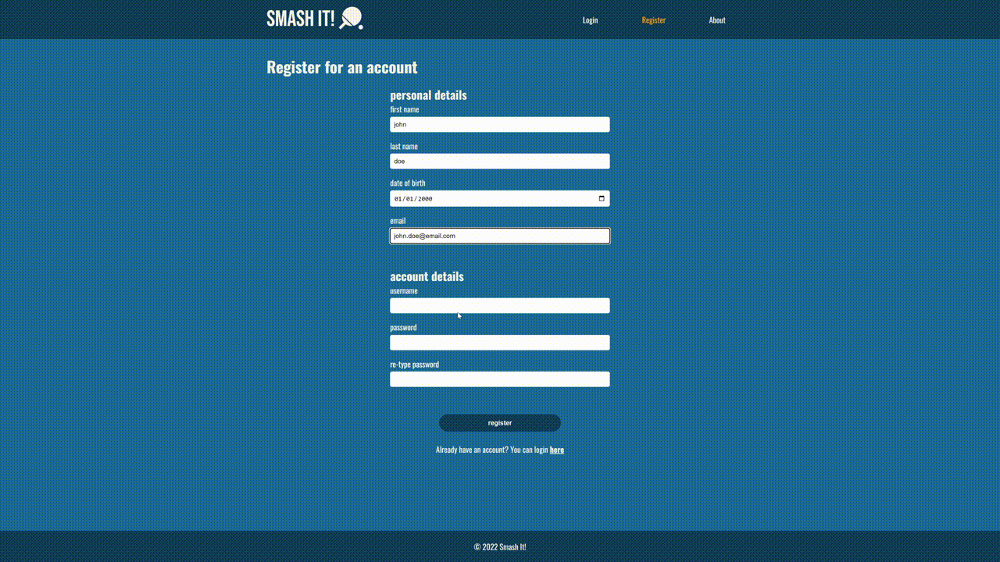

  <h1>Smash It! 🏓</h1>
  
  

    Performance tracking for table tennis.
  

 ### Please see Smash It! remastered [here](Excelsior2021/smash-it-client)

 

<!-- About the Project -->

## Motivation

This project was inspired by the competitive nature of table tennis during my web development bootcamp. Between classes we would religiously play table tennis every chance we got. A skill that is a staple for working in tech, being able to code merely comes 2nd place. As determination to be the best grew amongst us, we needed a way to track our stats and performance against each other. Methods such as using a spreadsheet or keeping score on a whiteboard proved inefficient or impraticable. As I was deciding on what to do for my capstone project, the idea occured to me to develop an app that would help us track our performance. Smashing two birds with one stone. Solving a problem that we had and having an idea for a project that would teach me invaulable skills.

## Usage

- A user would create an account.
- The user can then join an existing group or create a new group.
- A user can be a part of multiple groups.
- Members of a group will have stats pooled for that group. which can be viewed on a table for group stats or on a user's profile for individual stats.
- Members record scores for games played.

<!-- TechStack -->

## Tech Stack

### Client

- [React](https://react.dev), [React Router](https://reactrouter.com/en/main)
- [SASS](https://sass-lang.com)

### [Server](https://github.com/Excelsior2021/smash-it-server)

- [Express (Node.js Framework)](https://expressjs.com)
- [Knex.js](https://knexjs.org)
- [Objection.js](https://vincit.github.io/objection.js)

### Database

- [MySQL](https://www.mysql.com)

## Approach

Smash It! is a full stack JavaScript application. The client side is built as a SPA (Single Page Application) with React that uses React Router for client side routing and the useContext Hook to manage global state.

## Deployment

The client side is deployed on [Vercel](https://vercel.com).

## Enhancements

This project can be enhanced with the following features:

- Include other racket sports
- Improved UI/UX
- Messaging feature
